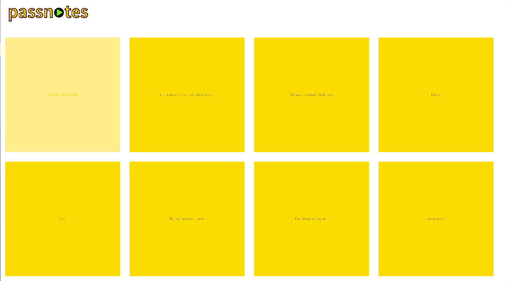
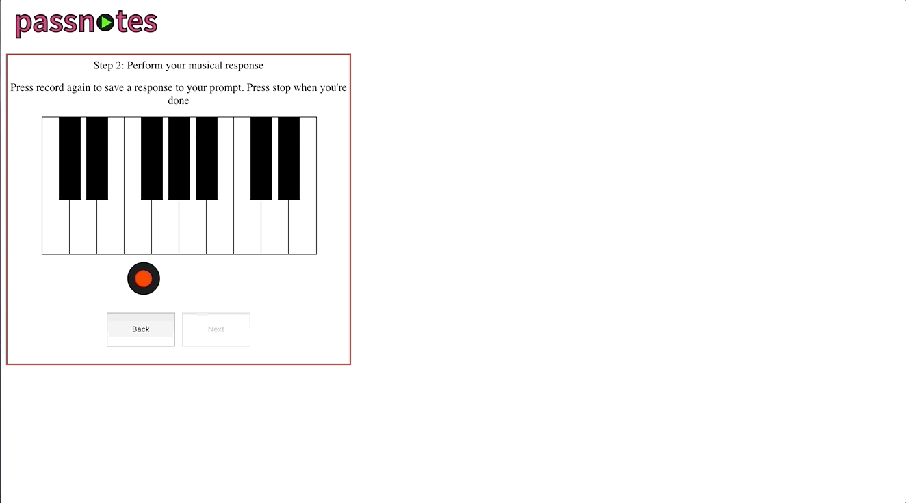
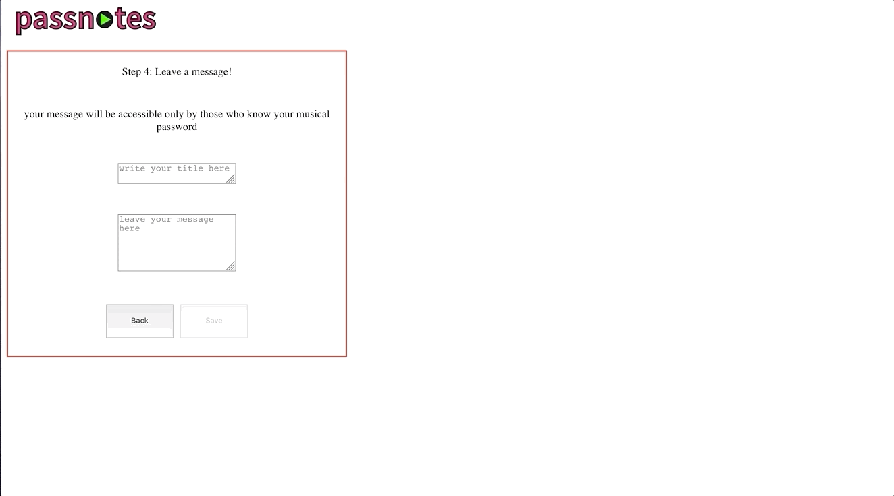

#Passnotes

A secret message board hidden behind musical passwords.  Conceptualized & prototyped as part of [Recurse Center] (https://github.com/recursecenter/)’s Security Week.  
[Click here](https://passnotes.herokuapp.com/) to use Passnotes.

##Usage
On the [landing page](https://passnotes.herokuapp.com/), all existing notes are displayed in a grid, with the most recent notes at the bottom.  You must know a note’s musical password to view it. 

###[Create a New Note](http://passnotes.herokuapp.com/Create)

From the landing page, click the pinned pale yellow note in the upper left corner.  You’ll see a piano on the screen– your keyboard is now responsive to key presses.  Use the asdfghjkl row of your keyboard to play notes– you’ll see the notes light up on the screen when triggered.  To play black keys (sharps or flats) use the w, e, t, y, u, o and p keys.  

####Create a Prompt
Press the red record button to capture a phrase that will serve as a prompt for your musical password.  Think of this like a username: it’s public, and will be played to anyone who clicks on your note.  It can also be used to contextualize key and tempo for a musical password. 

####Create a Password

Press the red record button to capture your musical password.  Anyone who knows this musical phrase will be able to access your message.  You’ll need to confirm this phrase just as you might authenticate a password– this is to make sure you can play it back consistently and keep you from getting locked out of your own message.

####Leave a Message

Once you’ve recorded your musical prompt and confirmed your musical password, you can write a new message to add to the noteboard.  Any users who know your musical password will be able to view and reply to this message.  Once you click save, you will be redirected to the note board displaying all existing notes in a grid.  Scroll down to the bottom to find the note you just created!

###Access an Existing Note

Click on the note you want to access.  You’ll be brought to an authentication screen with a piano keyboard.  Turn your volume up– the note’s prompt will play.  If you can play the correct musical password, you will be brought to the note’s message thread, where you can view and reply to its text.  Your replies will save to the note’s thread and become visible to anyone who can view the note.

##Specs
Frontend built with React, [create-react-app] (https://github.com/facebook/create-react-app), and [Tone.js] (https://github.com/Tonejs). Backend built with and Express and MongoDB.
